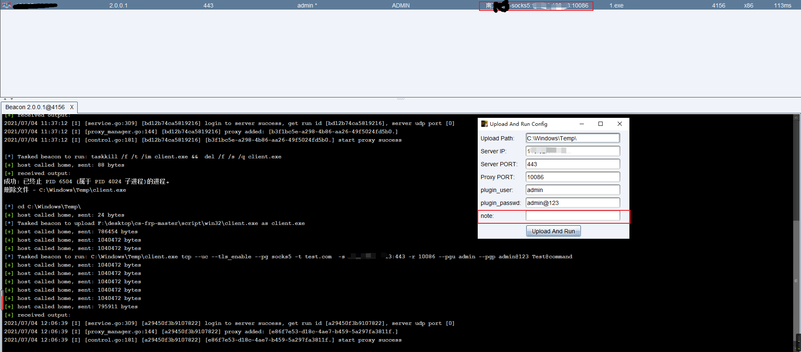
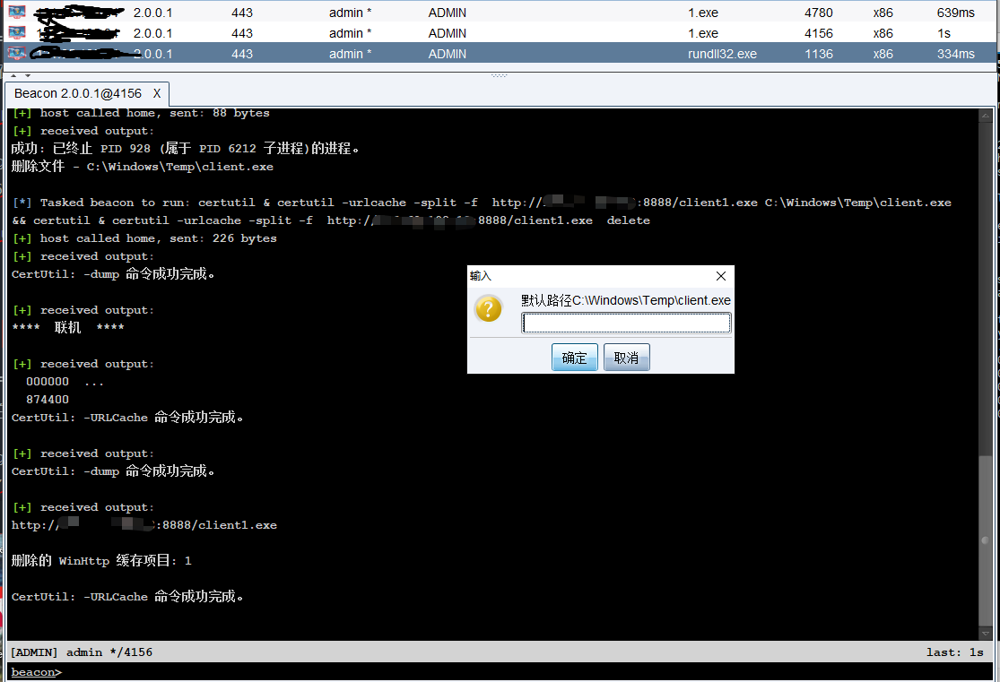
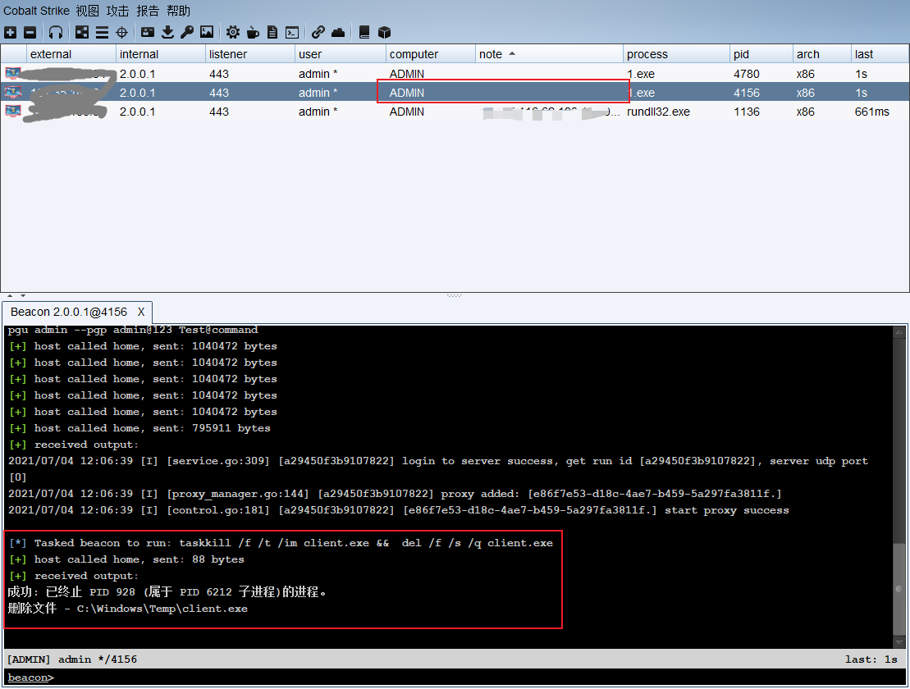
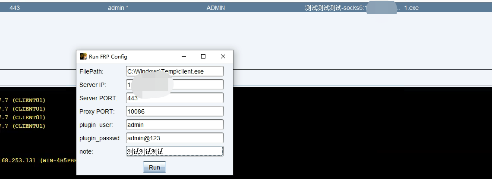

# FastRunFRP

在实战中上线多台主机需要快速做代理，主要分为四个部分；

**Upload and RUN FRP** 上传后自动运行代理FRP。在Cobalt Strike自动备注对应的代理信息防止代理太多分不清对应的目标，也可在note上备注对应的目标单位信息。方便协同作战。

**Download FRP** 使用云函数经常上传卡顿或者失败、可以使用下载功能到目标主机。

**Delete Process&file&note**项目结束后快速结束进程并删除程序，同时删除对应的备注。

**RUN FRP** 和Upload and RUN FRP差不多，少了上传的步骤。

## Upload and RUN FRP

默认tonken为test.com 

服务端运行：

```
./frp -t test.com -p 443
```

配置FRP菜单中配置对应的目录、VPSIP:PORT、代理端口、账号密码备注。



## Download FRP

默认文件在C:\\Windows\Temp\client.exe

输入frpURL即可使用certutil 下载同时删除缓存



## Delete Process&file

删除进程及对应的文件和note信息



## RUN FRP

输入对应的信息RUN即可




  \##  https://www.cobaltstrike.com/aggressor-script/functions.html

  \##  http://sleep.dashnine.org/manual/
